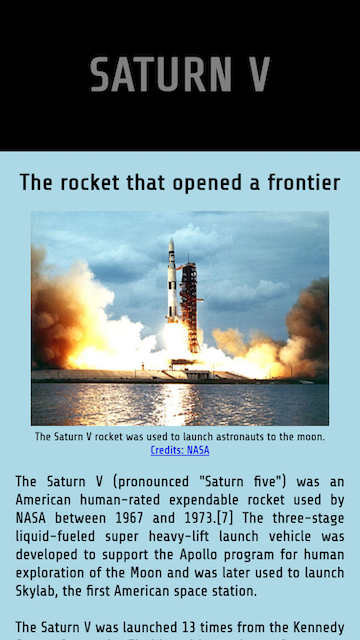
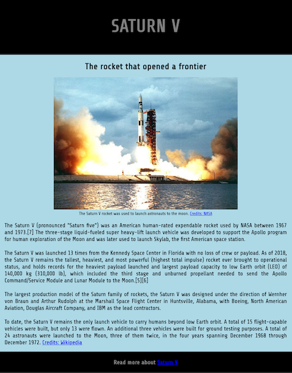

# Tribute Page
- 👋 Hi, I’m @WilliamSpanfelner
- 👀 This Tribute Page project is a component of the FreeCodeCamp Responsive Web Design Certification course.
     Check out the [project specifications](https://www.freecodecamp.org/learn/responsive-web-design/responsive-web-design-projects/build-a-tribute-page).
- 🌱 and the curiculum for the [Responsive Web Design Certification](https://www.freecodecamp.org/learn/responsive-web-design).  
- 🧑‍💻 The Product Landing Page employs flex and grid to style various components. 
- 💞️ I’m looking to collaborate on application development.
- 📫 How to reach me...

[//]: # ([![email]&#40;https://img.shields.io/badge/email-wil--1--am%40outlook.com-grey?style=plastic&#41;]&#40;mailto:wil-1-am@outlook.com&#41;)

